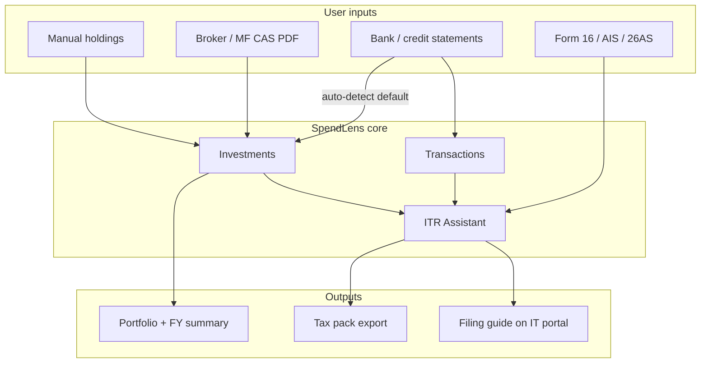

# SpendLens: Investments Portfolio + AI ITR Assistant

**Status:** Approved direction (user answers 2026-02-27)  
**Audience:** Salaried, investors, freelancers (ITR-1 through ITR-4 paths over time)  
**Disclaimer (product):** Assistive only — not a substitute for a Chartered Accountant. User files on [incometax.gov.in](https://www.incometax.gov.in).

---

## User decisions (locked)

| # | Question | Answer |
|---|----------|--------|
| 1 | Primary user | **All** — salaried, investors, freelancers/business (phased ITR forms) |
| 2 | ITR outcome v1 | **(a) Prep + export** and **(b) Step-by-step filing guide** on IT portal (no e-filing API in v1) |
| 3 | Asset types v1 | **All:** MF, stocks, FD, PPF, NPS, EPF, crypto, gold, real estate |
| 4 | Imports | **All channels**; **auto-detect from bank uploads by default**; prompt user for broker/MF CAS, Form 16, AIS, 26AS |
| 5 | Portfolio metrics | **Holdings + FY buys/sells** (no live NAV/XIRR required in v1) |
| 6 | Tax documents | **Prompt** Form 16 + AIS + 26AS; **still generate default** summary from existing bank/transaction data |
| 7 | Broker import priority | **Zerodha, Groww, CAMS/KFintech (MF CAS), HDFC Securities** first; generic CSV second |
| 8 | Tax regime | **Side-by-side** old vs new regime comparison |
| 9 | IndMoney parity | **All pillars:** portfolio, CAS import, tax/CG reports, ITR prep guide, net worth view |
| 10 | Legal disclaimer | **Yes** — shown in ITR and investment flows |

---

## Product vision

SpendLens becomes a **personal finance + tax prep** app:

- **Spends** (existing): bank/credit statements, categories, budgets  
- **Investments** (new): portfolio, FY activity, imports + manual, auto-detect from banks  
- **ITR Assistant** (new): readiness, document locker, AIS reconciliation, AI guidance, export pack + filing checklist  



---

## Feature 1: Investments & portfolio

### Goals

1. Track **all asset types** with holdings and FY buy/sell/dividend/interest events.  
2. **Auto-detect** investment-related bank transactions (Zerodha, Groww, CAMS, NPS, FD interest, etc.) from existing statement pipeline.  
3. **Prompt** user to add broker statements, MF CAS, and manual holdings when gaps exist.  
4. Feed **ITR Assistant** with FY investment tax summary (CG, interest, 80C-eligible, etc.).

### Navigation

```
Investments
├── Portfolio (holdings by type)
├── Activity (FY ledger: buy, sell, dividend, SIP, interest, contribution)
├── Import
│   ├── From bank (auto — review suggestions)
│   ├── Broker / demat statement
│   ├── MF CAS
│   └── Manual / bulk CSV
└── FY report (for ITR)
```

### Asset types & fields (v1)

| Type | Holdings | FY transactions |
|------|----------|-----------------|
| Mutual fund | Scheme, folio, units, avg cost, ELSS flag | Buy, sell, SIP, dividend, switch |
| Stock | Symbol, ISIN, qty, demat | Buy, sell, dividend |
| FD / RD | Bank, principal, rate, maturity | Opening, interest credit, maturity |
| PPF | Account, balance | Contribution, interest |
| NPS | PRAN, tier | Contribution (80CCD tracking) |
| EPF | UAN optional | Contribution (info) |
| Crypto | Exchange, coin, qty | Buy, sell (user-entered; tax note in ITR) |
| Gold | Form (SGB, physical, ETF) | Buy, sell |
| Real estate | Property label | Purchase, sale (sale → ITR CG schedule) |

### Auto-detect from bank (default)

When bank/credit statements are parsed, flag transactions matching patterns:

| Pattern | Likely type | Action |
|---------|-------------|--------|
| ZERODHA, GROWW, ANGEL, HDFC SEC | Equity/MF funding | Suggest `InvestmentTransaction` (transfer/contribution) |
| CAMS, KFINTECH, MFCENTRAL | MF | Link or suggest MF account |
| NPS, NSDL NPS | NPS | Contribution |
| FD INT, RD, term deposit | FD interest | Interest income for ITR |
| PPF, post office | PPF | Contribution |
| Dividend credits | Dividend | Link to holding if known |

**UX:** After statement parse → banner: *“12 transactions look like investments — Review”* → bulk accept/edit/reject.

### Import priority (broker formats)

**Phase 1 parsers:**

1. **Zerodha** — tax P&L / tradebook CSV  
2. **Groww** — stocks + MF statements (PDF/CSV as available)  
3. **CAMS / KFintech** — Consolidated Account Statement (MF CAS)  
4. **HDFC Securities** — common CSV layouts  
5. **Generic CSV** — column mapper UI (like bank CSV)

Use **layered hybrid parsing** (regex → AI → validate → merge), same as bank statements.

### Screens (wireframes)

**Portfolio hub**

- FY selector (Apr–Mar)  
- Cards: total invested (cost), holdings count, FY realized P&L (from sells), 80C-eligible contributions  
- Allocation chart by asset type  
- Holdings table with filters  

**Activity ledger**

- Filter: type, asset class, account, date range  
- Export CSV for FY  

**Import wizard**

1. Source: Bank suggestions | Broker | MF CAS | Manual  
2. Upload  
3. Preview table (editable)  
4. Confirm → merge into holdings + activity  

**FY investment summary (ITR input)**

- Realized STCG / LTCG (equity + MF) — from broker imports or manual  
- Interest (FD, savings) — from bank + certs  
- Dividends  
- 80C / 80CCD totals from tagged contributions  
- Warnings: AIS mismatches (when ITR docs uploaded)  

### Data model

```ruby
# investment_accounts  — Zerodha, CAMS, "SBI FD", manual
# investment_holdings    — current position per instrument
# investment_transactions — ledger events
#   kind: buy|sell|dividend|interest|contribution|transfer_in|transfer_out|sip
#   source: bank_detect|broker_import|mf_cas|manual
#   financial_year: computed from date (Apr-Mar)
#   links: optional transaction_id → bank Transaction
```

---

## Feature 2: AI ITR Assistant

### Goals

1. **Default FY summary** from bank transactions + detected investments (even without uploads).  
2. **Higher accuracy** when user uploads Form 16, AIS, Form 26AS.  
3. **AIS reconciliation** — compare IT department data vs SpendLens.  
4. **Old vs new regime** side-by-side estimate.  
5. **Savvy (AI)** — explain schedules, gaps, form choice (ITR-1/2/3/4).  
6. **Export tax pack** + **step-by-step guide** to file on incometax.gov.in.

### Navigation

```
ITR Assistant
├── FY dashboard (readiness %)
├── Income
├── Deductions
├── Taxes paid (TDS / advance)
├── Investments & capital gains (from Feature 1)
├── Documents (Form 16, AIS, 26AS)
├── Reconciliation
├── Regime compare (old vs new)
├── Ask Savvy
└── Export & filing guide
```

### Default vs enhanced accuracy

| Data source | Used for |
|-------------|----------|
| Bank credits (salary-like) | Salary hint, other income |
| Bank debits | Expenses (existing), 80C hints |
| Investment module | CG, interest, dividends, 80C/80CCD |
| Form 16 (upload) | Schedule salary (authoritative) |
| AIS (upload) | Reconciliation, missing income |
| Form 26AS (upload) | TDS credit |

**Always show:** “Generated from your data” vs “Verified from uploaded documents” badges.

### ITR form suggestion logic (v1 rules)

| Condition | Suggested form |
|-----------|----------------|
| Only salary + 1 house + interest, income ≤ threshold | ITR-1 |
| Capital gains, multiple properties, foreign assets, director, high income | ITR-2+ |
| Business income | ITR-3 / ITR-4 |

Show **why** the form was suggested; allow user override with warning.

### Document locker

Upload + AI extract (human confirm):

- Form 16 (Part A, B)  
- AIS (JSON/PDF)  
- Form 26AS  
- Broker tax P&L  
- MF capital gains statement  
- Rent/80D proofs (optional, old regime)

### Reconciliation screen

| AIS line | SpendLens | Status | Action |
|----------|-----------|--------|--------|
| Interest | Bank + FD | match / gap | Add / explain |
| LTCG | Portfolio | match / gap | Import broker |
| Salary | Form 16 | match | — |

### Regime comparison

Inputs: income buckets, deductions (80C, 80D, HRA from Form 16), standard deduction.  
Output: estimated tax **old vs new** + recommendation (“likely better: X”) with disclaimer.

### Export tax pack (ZIP/PDF)

- FY income & expense summary  
- Investment FY summary + CG table  
- Deductions summary  
- AIS reconciliation report  
- Old vs new regime worksheet  
- **Filing guide** (numbered steps for incometax.gov.in)  

### Filing guide (outcome b)

Static + personalized checklist:

1. Register / login IT portal  
2. Select AY and **recommended ITR form**  
3. Pre-fill review — map SpendLens export fields to portal sections  
4. Schedule CG / FA if applicable  
5. Tax paid verification (26AS)  
6. Regime selection  
7. Verify, e-verify  

Embedded **Savvy** prompts per step.

### AI (Savvy) ITR context

Include in prompt context:

- FY aggregates, readiness checklist gaps  
- Investment FY summary  
- Extracted Form 16 / AIS / 26AS fields (if uploaded)  
- Regime comparison numbers  

No auto-submit to government systems in v1.

---

## ITR requirements checklist (in-app)

Expose as interactive checklist on FY dashboard:

### Must have (most salaried)

- [ ] PAN linked with Aadhaar  
- [ ] Form 16 **or** salary credits identified in bank  
- [ ] Form 26AS reviewed  
- [ ] AIS reviewed  
- [ ] All bank accounts / interest reported  
- [ ] Correct ITR form selected  

### If investments

- [ ] MF/stock sales → capital gains schedule  
- [ ] Broker/MF tax statement or CAS imported  
- [ ] FD interest certificates or bank interest  
- [ ] Dividends (AIS vs portfolio)  

### Deductions (old regime)

- [ ] 80C proofs (max ₹1.5L)  
- [ ] 80D health insurance  
- [ ] 80CCD(1B) NPS (₹50k)  
- [ ] 24(b) home loan interest  
- [ ] HRA / LTA (Form 16)  

### Special

- [ ] Schedule FA (foreign assets) — if resident with foreign holdings  
- [ ] Schedule AL (assets & liabilities) — if income above threshold  
- [ ] Property sale documents — if real estate sold  

---

## IndMoney feature parity map

| IndMoney capability | SpendLens v1 | Later |
|---------------------|--------------|-------|
| Portfolio tracking | Holdings + FY activity | Live NAV, XIRR |
| CAS / statement import | MF CAS + broker PDF/CSV | Auto-sync |
| Tax / capital gains report | FY investment summary + export | Broker API |
| ITR filing | Prep + guide + export (not e-file API) | CA marketplace |
| Net worth | Invested cost + bank balances (approx) | Full account aggregation |

---

## Build phases

### Phase 1 — Foundation (MVP)

- DB: `investment_accounts`, `investment_holdings`, `investment_transactions`  
- Manual CRUD + FY filter  
- Bank auto-detect review UI (post statement parse)  
- ITR: enhanced FY dashboard, default summary from existing data, document upload slots, readiness checklist, disclaimer  

### Phase 2 — Imports & reconciliation

- Zerodha / Groww / generic CSV import  
- MF CAS import (hybrid parser)  
- Form 16, AIS, 26AS upload + AI extract + confirm  
- AIS reconciliation screen  

### Phase 3 — Tax depth

- Capital gains tables → export  
- Old vs new regime calculator  
- Savvy ITR mode + tax pack ZIP  
- Filing guide (personalized)  

### Phase 4 — Breadth

- Remaining asset types UI polish (crypto, gold, real estate)  
- ITR-3/4 paths for freelancers  
- Net worth dashboard  

---

## Non-goals (v1)

- Direct e-filing to Income Tax portal API  
- Guaranteed notice-free returns  
- Live market prices / trading  
- Licensed CA unless partnered later  

---

## Open technical notes

- Reuse `StatementParsing` hybrid pipeline for broker/MF PDFs.  
- Link `investment_transactions.transaction_id` → `transactions.id` when from bank detect.  
- Financial year helper: `FinancialYear.for(date)` → e.g. FY 2025-26 for date in Apr 2025–Mar 2026.  
- SQLite/Postgres: JSON columns for AIS/Form 16 extracted payloads until normalized.

---

## Success metrics

- % users with ≥1 investment holding after 30 days  
- % statements with accepted bank-detect suggestions  
- % ITR users uploading ≥1 of Form 16 / AIS / 26AS  
- Tax pack exports per FY season  
- Reduction in “missing income” reconciliation gaps after upload  
